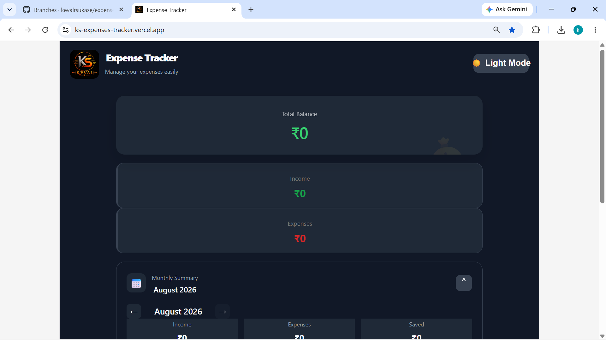

## 👨‍💻 Author

Made with ❤️ by **Keval Somnath Sukase**

[](https://github.com/kevalrsukase)

# 💰 Expense Tracker

A modern, responsive expense tracking application built with React.

The goal of this project is to build a practical everyday-use application while learning React, component-based architecture, state management, localStorage, responsive design, charts, and deployment with Vercel.

---

## 🚀 Live Demo

🔗 **Live App:** [https://ks-expenses-tracker.vercel.app/]

---

## 📸 Preview


### Desktop


### Mobile


---

## ✨ Features

### 💰 Transaction Management

- Add income and expenses
- Add transaction title
- Add amount
- Select transaction type
- Select transaction category
- Select transaction date
- Delete transactions
- Delete confirmation modal

### 📊 Dashboard

- Total balance
- Total income
- Total expenses
- Monthly savings
- Monthly transaction summary

### 📅 Monthly Summary

- View transactions for a selected month
- Navigate to previous months
- Navigate to next month
- Return to the current month
- Monthly income
- Monthly expenses
- Monthly savings

### 🥧 Expense Analytics

- Expense breakdown by category
- Interactive pie chart
- Category-based expense visualization
- Chart updates according to the selected month

### 🔍 Search & Filters

- Search transactions
- Filter by income
- Filter by expenses
- Filter by category

### 🔔 User Feedback

- Success toast when adding transactions
- Delete toast when removing transactions
- Delete confirmation modal

### 🎨 UI & UX

- Responsive design
- Mobile-friendly layout
- Light mode
- Dark mode
- Smooth UI interactions
- Accordion-style sections
- Custom KS branding

### 💾 Data Persistence

Transactions are stored using browser `localStorage`.

This means each user/browser has its own transaction data.

---

## 🛠️ Tech Stack

### Frontend

- React
- JavaScript
- HTML
- CSS

### Libraries

- Recharts

### Storage

- Browser localStorage

### Development

- Vite
- npm

### Deployment

- GitHub
- Vercel

---

## 📁 Project Structure

```text
expense-tracker/
│
├── public/
│   └── Metallic_KS_Emblem_with_Circuit_Accents.png
│
├── src/
│   │
│   ├── assets/
│   │
│   ├── components/
│   │   ├── Header.jsx
│   │   ├── BalanceCard.jsx
│   │   ├── SummaryCards.jsx
│   │   ├── MonthlySummary.jsx
│   │   ├── TransactionForm.jsx
│   │   ├── TransactionList.jsx
│   │   ├── ExpenseChart.jsx
│   │   ├── DeleteModal.jsx
│   │   └── Toast.jsx
│   │
│   ├── App.jsx
│   ├── App.css
│   └── main.jsx
│
├── index.html
├── package.json
├── package-lock.json
└── README.md

